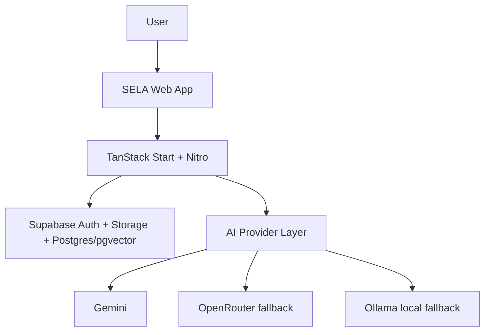
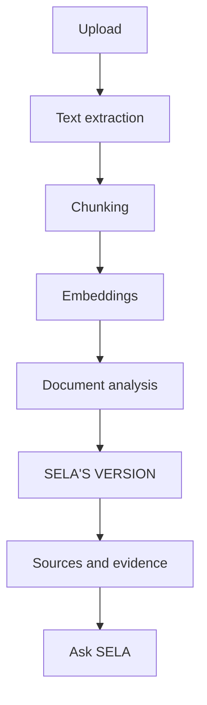
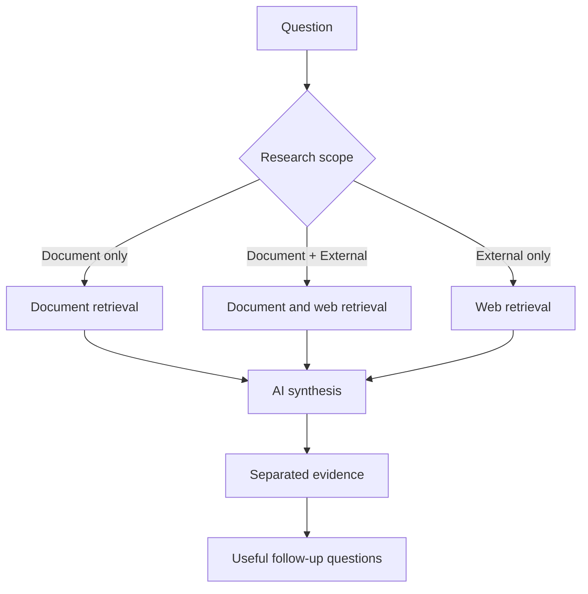

# SELA AI

SELA is an AI-powered legal document intelligence workspace. It helps people understand a contract or legal document, inspect important clauses, ask grounded questions, trace answers to evidence, add external context when needed, and export an Expert Memo.

SELA is a review aid, not a lawyer. It does not provide legal advice or make final legal determinations.

Live application: [sela-ai-zeta.vercel.app](https://sela-ai-zeta.vercel.app)<br>
Repository: [github.com/pd585/sela-ai](https://github.com/pd585/sela-ai)

## Problem

Important obligations, dates, exceptions, and costs are often difficult to find in legal documents. SELA organizes the document into a review workspace while keeping explanations connected to the text they came from.

## Core workflow

Upload → Understand → SELA'S VERSION → Inspect sources → Ask SELA → External research when needed → Follow-ups → Expert Memo → PDF

## Capabilities

- PDF and DOCX document upload and text processing
- Structured overview, key terms, clauses, issues, and SELA'S VERSION
- Original Document ↔ SELA'S VERSION review
- Source passages and evidence tracing
- Explain with SELA and multilingual explanations
- Ask SELA with document-only, document-plus-external, or external-only scope
- External source research and document-specific follow-up questions
- Expert Memo generation and PDF export
- Authentication and private, user-owned document storage

## Trust model

| Layer | Role |
| --- | --- |
| Original Document | Authoritative text for the review |
| SELA'S VERSION | Generated explanation for understanding and review |
| Document Sources | Evidence passages from the uploaded document |
| External Sources | Separate context retrieved outside the document |
| AI | Reasoning and synthesis layer, subject to verification |

## Architecture







## Technology

- React 19 and TypeScript
- TanStack Start, TanStack Router, and Vite
- Nitro production server with Vercel deployment
- Supabase Auth, Storage, Postgres, and pgvector
- Gemini, OpenRouter, and optional local Ollama provider fallback
- Drizzle migrations and Vitest tests
- Tailwind CSS, Radix UI, and Lucide icons

## Local development

Requirements: Node.js and npm.

```sh
git clone https://github.com/pd585/sela-ai.git
cd sela-ai
npm ci
```

Copy `.env.example` to `.env` and fill in the values for your Supabase and AI providers. Never commit `.env` or production credentials.

```sh
npm run dev
```

Useful verification commands:

```sh
npm test
npx tsc --noEmit
npm run lint
npm run build
```

The production build creates `.output/public` and `.output/server/index.mjs`. Run the generated server with `node .output/server/index.mjs` when testing the production runtime locally.

## Environment variables

| Variable | Purpose |
| --- | --- |
| `SUPABASE_URL` | Server-side Supabase project URL |
| `SUPABASE_PUBLISHABLE_KEY` | Server-side publishable Supabase key |
| `SUPABASE_SERVICE_ROLE_KEY` | Server-only service role key for privileged operations |
| `VITE_SUPABASE_URL` | Supabase URL exposed to the browser client |
| `VITE_SUPABASE_PUBLISHABLE_KEY` | Browser-safe Supabase key |
| `APP_URL` | Server application URL configuration |
| `GEMINI_API_KEY` | Gemini provider credential |
| `GEMINI_LLM_MODEL` | Gemini text model |
| `OPENROUTER_API_KEY` | Optional OpenRouter fallback credential |
| `OPENROUTER_LLM_MODEL` | OpenRouter model |
| `OLLAMA_BASE_URL` | Optional local Ollama endpoint |
| `OLLAMA_LLM_MODEL` | Local Ollama model |
| `EMBEDDING_PROVIDER` | Embedding provider selection |
| `EMBEDDING_MODEL` | Embedding model selection |

## Security and privacy

Supabase Row Level Security and authenticated ownership checks scope documents to their users. Private storage policies protect uploaded files. AI provider secrets remain server-side. Document retrieval and external research are kept as separate evidence scopes, and prompts are bounded to the selected document passages rather than treated as trusted instructions.

## Testing

The current verification suite passes 26 tests. TypeScript completes without errors. ESLint completes with no errors and six existing Fast Refresh warnings in UI component files. The production build completes successfully.

## Limitations

AI output can be imperfect and should be checked against the source document. External source availability varies. Local development providers may differ from production configuration. SELA does not replace a qualified legal professional.

## Repository structure

```text
src/       Application, routes, server functions, and integrations
tests/     Unit and integration-oriented tests
drizzle/   Database schema and migrations
public/    Small static assets
supabase/  Local Supabase configuration
```
