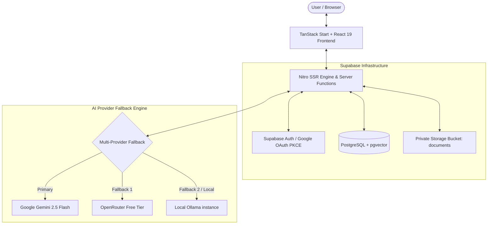
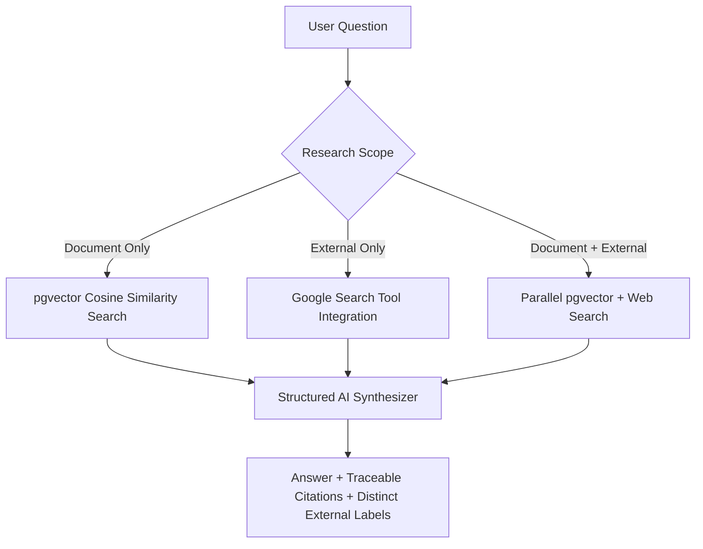

# SELA AI — Evidence-First Legal Document Intelligence

> **"HIDE THE MACHINERY. EXPOSE THE INTELLIGENCE."**

SELA is an AI-powered legal document intelligence workspace designed to help individuals, legal teams, and business operators understand contracts and legal documents clearly. Built on an evidence-first philosophy, SELA organizes complex agreements into an interactive review workspace, produces plain-language explanations with preserved legal fidelity, supports grounded multi-scope question answering, and exports structured Expert Memos to PDF.

*Disclaimer: SELA is an interactive reading and review aid, not a law firm or a lawyer. It does not provide formal legal advice or make binding legal determinations. For consequential legal decisions, consult a qualified professional.*

- **Live Application:** [https://sela-ai-zeta.vercel.app](https://sela-ai-zeta.vercel.app)
- **GitHub Repository:** [https://github.com/pd585/sela-ai](https://github.com/pd585/sela-ai)

---

## The Problem

Contracts and legal agreements often obscure critical obligations, deadlines, liabilities, and exceptions under dense legal terminology. When non-lawyers or busy professionals try to evaluate these documents, they face significant friction:
- **Hidden Risks:** Ambiguous notice periods, asymmetric indemnities, automatic renewal traps, and non-refundable fees are buried deep within pages of boilerplate.
- **Hallucination Risk:** Generic AI chat assistants summarize documents without verifiable citations, often confusing dates or inventing terms.
- **Unclear Authority:** AI-generated summaries frequently blur the line between what the contract actually states versus external legal assumptions.

SELA solves this by anchoring every finding, summary, answer, and visual explanation directly to verified source passages from the uploaded document.

---

## What SELA Does

1. **Ingests & Structures:** Accepts PDF and Word (`.docx`) documents up to 25 MB, extracting multi-page text into structured, overlapping vector chunks.
2. **Generates Grounded Overviews:** Analyzes parties, purpose, key dates, defined terms, and significant clauses without assigning subjective risk scores.
3. **Creates SELA'S VERSION:** Rewrites the agreement into structured plain language while strictly preserving section references, dates, numbers, parties, and obligations.
4. **Enables Dual-Layer Ask SELA:** Allows users to query the document using three distinct research scopes (Document Only, Document + Web Search, or External Only) with clearly separated citations.
5. **Provides Multilingual Explanations:** Explains complex clauses and terms in **English**, **Telugu**, **Hindi**, **Malayalam**, and **Kannada**, maintaining all legal citations and figures intact.
6. **Exports Expert Memos:** Generates comprehensive, client-ready legal briefing memos formatted with side-by-side comparisons and downloadable as styled PDFs.

---

## Core Workflow

```text
Upload (PDF/DOCX)
  → Text Extraction & Page Normalization
    → Sliding-Window Chunking
      → 3072-Dimensional Vector Embeddings
        → Core Analysis & SELA'S VERSION Generation
          → Interactive Review Workspace
            → Multi-Scope Ask SELA & Evidence Tracing
              → Expert Memo Briefing & PDF AutoTable Export
```

---

## Key Capabilities

### 1. Document Understanding & Overview
- **Document Metadata & Purpose:** Identifies governing document type, primary commercial purpose, and contracting parties.
- **Key Terms Directory:** Extracts defined terms alongside their document-specific meanings with direct links to defining chunks.
- **Clauses & Observations:** Summarizes critical operational clauses (*What It Says*) and highlights clauses requiring inspection (*Why Inspect*).
- **Descriptive Issues:** Identifies open-ended commitments, missing safeguards, and ambiguous terms factually without arbitrary scores.
- **Source Passages:** Interactive drawer that displays exact extracted text excerpts and original page numbers.

### 2. Ask SELA (Evidence-Grounded Q&A)
- **Document-Only Scope:** Answers questions strictly from document chunks; abstains with a clear explanation if the document does not contain the answer.
- **Document + Web Search Scope:** Augments internal contract analysis with real-time public statutory, regulatory, and gazette citations.
- **External-Only Scope:** Conducts public legal research independently of document context.
- **Source Traceability:** Every factual statement includes clickable citation badges linking to verifiable document excerpts.
- **Contextual Follow-Ups:** Automatically suggests 2–3 relevant follow-up questions to uncover related contractual nuances.

### 3. SELA'S VERSION & Side-by-Side Comparison
- **Plain-Language Redlines:** Translates legalese into accessible terms while protecting core legal meaning.
- **Obligation Preservation:** Maintains exact figures, deadlines, currencies, and conditions.
- **Synchronized Comparison:** Dual-pane desktop view displaying the authoritative Original Document alongside SELA'S VERSION with coordinated navigation.

### 4. Explanations & Multilingual Support
- **Contextual "Explain with SELA":** One-click clause explanations tailored for non-specialists.
- **5 Supported Languages:**
  - **English (`en`)**
  - **Telugu (`te` / తెలుగు)**
  - **Hindi (`hi` / हिन्दी)**
  - **Malayalam (`ml` / മലയാളം)**
  - **Kannada (`kn` / ಕನ್ನಡ)**
- **Immutability Safeguards:** Numbers, party names, currencies, dates, and statute citations remain untranslated to prevent ambiguity.

### 5. Grounded Visual Intelligence
- **Interactive Diagrams:** Renders structured timelines, obligation flows, responsibility maps, process flows, and clause relationship charts derived directly from document milestones.

### 6. Expert Memo & PDF Export
- **Comprehensive Briefing:** Synthesizes executive summary, key risks, negotiation levers, SELA'S VERSION comparison, and statutory references.
- **Client-Side PDF Generation:** Built with `jspdf` and `jspdf-autotable` for clean vector pagination, headers, structured tables, and disclaimer footers.

---

## Trust & Evidence Model

SELA maintains a strict evidentiary hierarchy to guarantee transparency:

| Layer | Authority Level | Role in Workspace |
| :--- | :---: | :--- |
| **Original Document** | **Authoritative (100%)** | The binding legal source of truth. Always preserved and viewable. |
| **Document Sources** | **Primary Evidence** | Extracted page numbers and raw text passages backing every finding. |
| **SELA'S VERSION** | **Interpretive Aid** | Plain-language rewriting for review and understanding; non-authoritative. |
| **External Sources** | **Contextual Reference** | Public statutes, regulations, or case law retrieved via search; explicitly separated. |
| **AI Reasoning Layer** | **Synthesis Engine** | Provider pipeline generating structured outputs under strict schema boundaries. |

---

## Architecture



---

## Document Intelligence Pipeline

```mermaid
flowchart LR
    Doc[PDF / DOCX Upload] --> Validate[25 MB & MIME Validation]
    Validate --> Extract[Client Text Extraction: pdfjs / mammoth]
    Extract --> Chunk[Sliding Window Chunking: 1400 chars / 180 overlap]
    Chunk --> Embed[Gemini 3072-dim Embeddings]
    Embed --> Store[(Supabase pgvector)]
    Store --> Analysis[Structured Analysis Engine]
    Analysis --> Review[Interactive Workspace & SELA'S VERSION]
```



---

## Ask SELA Research Model



---

## AI Provider Architecture

SELA features a 3-tier resilient provider pipeline configured in `src/lib/ai.server.ts`:

1. **Primary Provider — Google Gemini 2.5 Flash:**
   - Native structured JSON schema outputs (`responseSchema`).
   - Native Google Search grounding tool integration for external verification.
   - 3072-dimensional embeddings via `gemini-embedding-2`.
2. **First Fallback — OpenRouter Free Tier:**
   - Automatically engaged if Gemini API limits, quotas, or 401/429/500 errors occur.
   - Enforces strict token bounding (`max_tokens: 3072`) to eliminate HTTP 402 credit exhaustion issues.
3. **Optional Local Fallback — Ollama:**
   - Local development failover (`http://localhost:11434` with `llama3.2`).
   - Ensures local offline development when third-party API keys are absent.

*All provider outputs are validated through strict Zod schemas before reaching the client.*

---

## Security & Privacy

- **Row Level Security (RLS):** All database tables (`documents`, `document_chunks`, `document_questions`) enforce strict isolation policies ensuring users only access their own data (`auth.uid() = user_id`).
- **Private Storage Bucket:** The `documents` Supabase storage bucket is private. Uploads and downloads require signed user session tokens.
- **Upload Restrictions:** 25 MB file size limit enforced on both client and server; MIME type validation restricts uploads strictly to `application/pdf` and `.docx`.
- **URL Sanitization:** External citation links are strictly validated to permit only safe `http://` and `https://` schemes.
- **Prompt Injection Resilience:** Untrusted document text and user queries are wrapped in isolated context blocks with strict system delimiters.
- **Server-Side Secrets:** API keys for Gemini, OpenRouter, and Supabase Service Role are executed strictly in server functions and never bundled into client assets.
- **Lifecycle Cleanup:** Deleting a document triggers cascade deletion of chunks, embeddings, questions, and physical storage files.

---

## Local Development

### Prerequisites
- **Node.js:** v20.x or later
- **npm:** v10.x or later

### Step-by-Step Setup

1. **Clone the repository:**
   ```sh
   git clone https://github.com/pd585/sela-ai.git
   cd sela-ai
   ```

2. **Install dependencies:**
   ```sh
   npm ci
   ```

3. **Configure environment variables:**
   ```sh
   cp .env.example .env
   ```
   Edit `.env` with your Supabase credentials and Gemini/OpenRouter API keys.

4. **Start the local development server:**
   ```sh
   npm run dev
   ```
   Open [http://localhost:3000](http://localhost:3000) in your browser.

---

## Environment Variables

| Variable | Required | Description |
| :--- | :---: | :--- |
| `SUPABASE_URL` | Yes | Supabase project URL (Server-side) |
| `SUPABASE_PUBLISHABLE_KEY` | Yes | Supabase publishable anon key (Server-side) |
| `SUPABASE_SERVICE_ROLE_KEY` | Optional | Privileged Supabase service role key (Admin tasks) |
| `VITE_SUPABASE_URL` | Yes | Supabase project URL (Client-side) |
| `VITE_SUPABASE_PUBLISHABLE_KEY` | Yes | Supabase publishable anon key (Client-side) |
| `GEMINI_API_KEY` | Yes (Primary) | Google Gemini API key for embeddings & analysis |
| `GEMINI_LLM_MODEL` | Optional | Gemini model name (Default: `gemini-2.5-flash`) |
| `OPENROUTER_API_KEY` | Optional | OpenRouter API key for fallback LLM completions |
| `OPENROUTER_LLM_MODEL` | Optional | OpenRouter model identifier (Default: `google/gemini-flash-1.5`) |
| `OLLAMA_BASE_URL` | Optional | Local Ollama endpoint (Default: `http://localhost:11434`) |
| `OLLAMA_LLM_MODEL` | Optional | Local Ollama model (Default: `llama3.2`) |

---

## Testing & Quality Gates

The codebase enforces strict quality controls across all layers:

```sh
# Run full automated test suite (Vitest)
npm test

# Run TypeScript strict typecheck
npx tsc --noEmit

# Run ESLint analysis
npm run lint

# Run production SSR build
npm run build

# Audit production dependencies
npm audit --omit=dev --audit-level=high
```

### Current Quality Verification Status
- **Automated Tests:** 31 / 31 tests passing across 7 test suites (`~2.7s` execution via dedicated `vitest.config.ts`).
- **Type Safety:** 0 TypeScript errors under strict configuration.
- **Linting:** 0 ESLint errors (6 standard Fast Refresh warnings in UI component primitives).
- **Production Build:** Clean client bundle and Nitro server build in `~2.8s`.
- **Security Audit:** 0 high or critical production vulnerabilities.
- **Repository Size:** ~1.013 MB (safely within the 10 MB limit).

---

## Supabase Setup & Migrations

Detailed setup instructions for PostgreSQL schemas, pgvector, and Google OAuth with PKCE are provided in [SUPABASE_SETUP.md](./SUPABASE_SETUP.md).

### Migration Files
- `drizzle/migrations/0000_sela_core_schema.sql`: Core schema, documents table, chunks table with `vector(3072)` columns, RLS policies, and vector similarity RPC function.
- `drizzle/migrations/0001_documents_storage_policies.sql`: Private storage bucket RLS policies scoping file access to `auth.uid()`.
- `drizzle/migrations/0002_documents_bucket_limits.sql`: Bucket-level constraints enforcing 25 MB file size limit and MIME restrictions (`application/pdf`, `.docx`).

---

## Repository Structure

```text
├── drizzle/                     # Database migrations & Drizzle ORM schema
│   ├── migrations/              # SQL migration scripts (0000, 0001, 0002)
│   └── schema.ts                # TypeScript table definitions
├── src/
│   ├── components/
│   │   ├── sela/                # Core SELA pages (Home, Review, Ask SELA, Memo)
│   │   └── ui/                  # Radix UI primitives & accessible components
│   ├── integrations/
│   │   └── supabase/            # Client, auth middleware, and typed schema
│   ├── lib/
│   │   ├── ai.server.ts         # Multi-provider LLM & embedding fallback engine
│   │   ├── expert-memo-pdf.ts   # AutoTable PDF export engine
│   │   ├── extract-text.ts      # PDF & DOCX parser with 25 MB validation
│   │   └── sela.functions.ts    # TanStack Start server functions & Zod schemas
│   └── routes/                  # TanStack Router file-based routing
├── tests/                       # Vitest integration & unit test suites
├── public/                      # Static assets & web manifest
├── SUPABASE_SETUP.md            # Supabase database & storage setup guide
├── vitest.config.ts             # Isolated Vitest configuration
└── vite.config.ts               # Production Vite & TanStack Start build configuration
```

---

## Limitations

- **Human Review Required:** SELA is designed to assist comprehension and highlight key clauses. Generated explanations and redlines must always be verified against the original authoritative document.
- **External Web Availability:** External statutory verification depends on Google Search tool availability and active public legal registries.
- **Local Provider Differences:** Local Ollama models produce outputs matching the model's capacity and may differ slightly in precision from Gemini 2.5 Flash.

---

## Project Status

SELA AI was developed for the **Hack2Skills PromptWars** hackathon as an evidence-first legal document intelligence workspace.

---

## License

MIT License. See [LICENSE](./LICENSE) for details.
